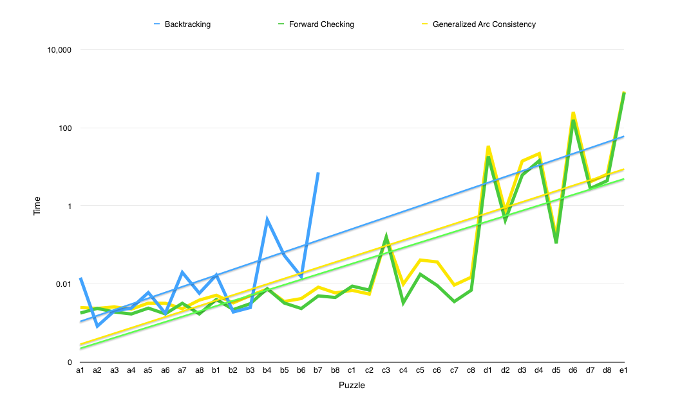
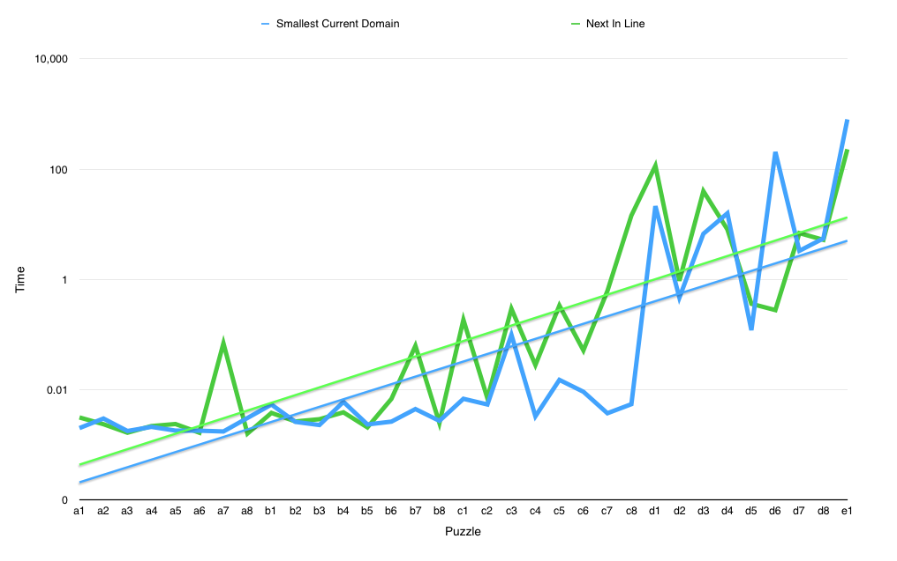

# CSC384 Final Project

#### Authors

- Christian Lessard
- Robertson McClure
- Jeffery McBride

## Table of Contents

1. Project Motivation
2. Methods
  - Formulating Hidato
  - Encoding Constraints
  - Variable Selecting Heuristics
3. Evaluation and Results
  - Verifying Solution
  - Comparing Propagators
  - Comparing Heuristics
4. Limitations and Obstacles
  - Constraint Construction
  - NP-Completeness
  - Implementation
5. Conclusions
  - Next Steps
  - Overall Insights
6. Works Cited

## Project Motivation

Hidato is a logic puzzle game invented by Israeli mathematician Dr. Gyora M. Benedek. The game takes the form of a grid with several cells containing numbers, and the rest without numbers. Every grid must have 1 and the final number placed on the board. A player must solve the puzzle by forming a path of adjacencies whereby any given number on the board has both the precedent and subsequent number as a neighbour. Neighbours may be along the horizontal, vertical or diagonal axis.

Hidato is known to be NP-Complete, meaning that no known polynomial time algorithm exists to solve instances of the game.

We decided to interpret Hidato as a Constraint Satisfaction Problem (CSP), using techniques from the field of Artificial Intelligence to derive solutions to game instances in a reasonably short amount of time. Such an interpretation also allowed us to test various heuristics and propagators so that we may examine their comparative performance.

## Methods

### Formulating Hidato

To formulate Hidato as a CSP, you need to decide what a Variable is, what a Variable's Domain is and how to define a Constraint, amongst other questions.

Our first approach was to have every square on the board be a Variable, with the current domain being possible values. However, this decision was not ideal as we were not able to implement any variable selection heuristics (this will be expanded upon later). We decided that every value (1,2, ...) should be a Variable, and each Variable's current domain would be the cartesian coordinates of the possible locations for it on the board.

Our first approach for representing Constraints was as follows. Every cell on the board would have one constraint. That constraint would demand that if it has a value, then the precedent and subsequent numbers must be neighbouring OR there must be enough empty spaces next to it. The evaluation function was extremely messy so we decided upon a different type of constraint. Now each constraint is a relation between Variables. We started with the obvious "1 has to be next to 2", "2 has to be next to 3", etc. but changed to "2 needs 1 and 3 next to it", "3 needs 2 and 4 next to it", etc. for reasons that will be discussed later (in Limitations and Obstacles).

### Encoding Constraints

After studying CSPs in CSC384, we implemented one as an assignment for a game called Tenner. This assignment used provided backend code that was extremely expensive in terms of space complexity. This was due to the fact that it relied on each constraint having access to a pre-calculated list of every possible satisfying assignment of the variables in its scope. Although this made constraint evaluation quick (with the use of a dictionary), it was taxing on memory and came at the expense of spending time generating each satisfying assignment. We decided that we could rewrite the backend code to dramatically improve this space-complexity issue, without doing so at the cost of efficient time complexity. At first, we believed it would suffice to pass an evaluation function to each constraint, rather than a lookup table of valid solutions. We noticed, however, that constraints in Hitado should only involve pairs of neighbouring numbers. We decided to give every constraint the same structure (checking that three adjacent numbers were placed next to each other on the board), allowing us to define a single, constant time evaluation function for all of them. To check a constraint over three variables, dubbed a “start”, “middle” and “end” variable, one need only apply the following function:

```python
define check(constraint):
  return next_to(constraint.start, constraint.middle) and next_to(constraint.middle, constraint.end)

define next_to(coord1, coord2):
  return abs(coord1[0] - coord2[0]) <= 1 and abs(coord1[1] - coord2[1]) <= 1 and not coord1 == coord2
```

### Variable Selecting Heuristics

In the function `bt_recurse` there is this section of code:

```python
def bt_recurse(self, propagator, level):
      if not self.unasgn_vars:
          return True
      else:
          var = min([var for var in self.unasgn_vars if not var.coord], key = self.heuristic)
          self.unasgn_vars.remove(var)
```

It's purpose is to select the next variable to assign a value to. We make this selection by ordering the variables by a heuristic and then taking the variable that best fits said heuristic. Here are some sample heuristics that could be used:

```python
smallest_cur_dom = lambda x: len(x.cur_dom)

next_in_line = lambda x: x.value

random_selection = lambda x: random.random()
```

The use of propagators like Forward Checking and Generalized Arc Consistency provide Backtracking Search with a heuristic – known as the Minimum Remaining Value heuristic – for making decisions about which variables to assign next. This heuristic sees Backtracking Search pick whichever variable has the smallest current domain as the next to be assigned. Because we assign coordinates to variables, we were also able to use the “Next In Line” heuristic, which has Backtracking Search pick the next smallest unassigned number. The comparison of these heuristics will be presented in the next section.


## Evaluation and Results

### Verifying Solution

To evaluate a solution, we wrote a polynomial time verifier function. This function, written as a method called “verify” in class CSP, begins with the variable encoding the starting number 1, and attempts to traverse the subsequent neighbours checking for their adjacencies on the board.

### Comparing Propagators

When there are multiple propagators available at ones disposal, you have to try them all. This is exactly what we did. We have 33 puzzles in a file called `puzzle_bank.py`. They are organized by level of difficulty. The first 32 puzzles are all 6x6 grids, the last one is a 7x7 grid.

We plotted how long enough propagator took to solve a puzzle. We used a logarithmic scale because the difficulty of these problems increase exponentially (due to NP-Complete). The logarithmic scale also is able to accentuate the differences in performance when the results are 0.001 of a second, and be able to compare it with results in the hundreds of seconds. The trend lines are exponential (which appear linear on a logarithmic scale).



As you can see above, plain Backtracking Search is incredibly inefficient. After the 16th board, Backtracking would have taken so long that this report would not have been finished in time. Therefore we only ran backtracking on the first 16 boards and included the trend line so you can extrapolate what might have happened.

It cannot be stated enough that this graph has a logarithmic scale. If we compare the two highest points (d6 and e1), it appears as if they took basically the same amount of time. However, d6 took around 200 seconds and e1 took around 800 seconds, not close at all. Please remember this when viewing these graphs.

The conclusion we can draw is that Forward Checking out performs Generalized Arc Consistency on nearly every single puzzle. There are some exceptions (c3) but as you can see the general trend is that Forward Checking solves these problems faster.

### Comparing Heuristics

We have three heuristics at our disposal for testing.

- Smallest Current Domain
- Next In Line
- Random

Smallest Current Domain is the most intelligent one, as it takes the variable that is most constrained, the variable that it is most likely to get right placing.

Next In Line is a fun heuristic, as it always choses to place the smallest value not yet on the board. It should be clear that this is not optimal, but is a strategy that most use when trying to solve hidato by hand.

Random was the only other heuristic I could think of that was possible to use in this scenario. However, we did not end up using random as it's performance on harder boards was so unsatisfactory (many hours) that we grew impatient and halted that entire experiment.



As you can see Smallest Current Domain greatly outperformed Next In Line, as the trend lines indicate. However, I think that it's very interesting that on board d6, a very difficult board, Next In Line had an amazing performance. It outperformed Smallest Current Domain on the scale of several orders of magnitude: SCD 205 seconds, NIL 0.2 seconds. I believe this ridiculous performance is the result of that particular board setup. This heuristic happened to get lucky with every selection and the inherent drawbacks were cancelled out by the fact that it happened to place variables in the correct spots on the first try.

## Limitations and Obstacles

### Constraint Construction

Anecdote about how 2 variable constraints did not work

### NP Completeness

As mentioned at the beginning of the report, Hitado is proven to be in the class of NP Complete problems. This meant that we would likely be restricted to relatively small boards – at least, smaller than our liking – and that interesting results would come from two particular sources: the implementation of the backend code supporting our CSP, and the comparison of propagators and heuristics applied to Backtracking Search. Despite possible board-dimension limitations, we were correct in believing that interesting discoveries could still be made.

### Implementation

The most time consuming and difficult part of the project involved writing the base code for the CSP. It was the most bug-prone, and required us to think through everything quite carefully. We’re happy with how things turned out, as we believe our code to be quite fast and elegant. We know that boards of dimensions exceeding 12x12 are too demanding of our CSP to see results in a reasonable amount of time, and it is not immediately obvious how we might circumvent this issue. We also struggled to find more propagators and heuristics to test with our code, simply because many of them are described in research papers we did not have time to read.

## Conclusions

### Going Forward

##### Evaluating Board Difficulty

It would have also been nice to spend more time developing a stricter measure of difficulty for Hidato boards in general, and testing our work with that measure in mind. Although we did not have time to elaborate on such a definition, we did come up with the following ideas that may one day help us develop something more concrete:

- Board dimensions or, more generally, the number of cells on the boards, are a general indicator of difficulty, because it determines the amount of work to be done.
- The number of given values on a board reduces its difficulty, as this reduces the total number of cells for which a value must be calculated.
- Which values are given can have a large impact on difficulty; we found boards of identical dimensions and varying difficulty.

We believe that difficulty could be represented as a ratio between board size and the number of given variables on the board, although this would take more thought. Thankfully, our code is modular enough that it should be easy to extend in the future.

##### More Propagators

Additionally, the creation of a wider variety of propagators would have lead to a more interesting analysis of the performances.

##### Better UI

Create a live updating interface for observing the CSP. Watch as variables are assigned and unassigned in real time. This would allow the user to see exactly where the CSP gets stuck for an extended amount of time.  

### Overall Insights

We learned that a well-planned CSP implementation will bare an enormous impact on the results of the problem.

## Works Cited
